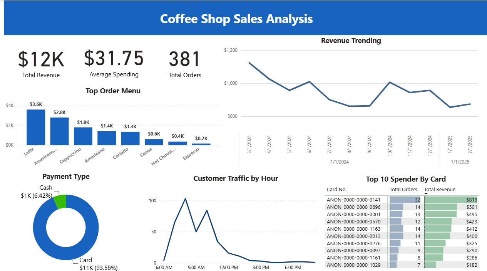

# Coffee Shop Sales Analysis Dashboard

## Background & Overview
Coffee shop businesses rely on sales data to monitor performance, understand customer purchasing patterns, and make informed operational decisions. Even with a relatively small transaction dataset, sales records can provide valuable insights into revenue trends, product performance, and customer behavior over time.

This project analyzes historical coffee shop sales data using Power BI to answer key business questions and transform raw transaction data into actionable insights for decision-making.

## Analysis Framework
This project aims to answer three strategic business questions:
1. How has revenue performed over the past 12 months?
2. Which products contribute the most to overall sales, and are there any products experiencing declining performance?
3. During which hours does the coffee shop experience peak customer traffic, and how can operations be optimized?

## Executive Summary
### Overview of Findings
This analysis evaluates coffee shop sales performance over a 12-month period to identify revenue trends, product contribution, and operational patterns that support data-driven business decisions.

Overall, the business generated $12K in total revenue from 381 customer orders, with an average spending of $31.75 per transaction. While the number of monthly orders remained relatively stable throughout the analysis period, revenue showed a gradual decline toward the end of the year, suggesting that lower customer spending, rather than reduced transaction volume, became the primary factor affecting business performance.

In addition, product-level analysis reveals differences in sales contribution across menu items, while customer traffic analysis highlights opportunities to optimize staffing allocation and promotional strategies based on peak and off-peak operating hours.

  

Revenue Performance
* Revenue declined by approximately 22% between the beginning and the end of the analysis period. While monthly order volume remained relatively consistent, average customer spending dropped noticeably during the middle of the year and did not fully recover afterward. This suggests that customers continued to visit the coffee shop but spent less per transaction.

Product Performance
* Product sales were concentrated among a small number of menu items. Latte and Americano with Milk consistently generated the highest sales volume, whereas products such as Espresso and Hot Chocolate contributed only a small portion of total sales. This imbalance indicates opportunities to improve the performance of lower-selling products through targeted promotions or menu optimization.

Operational Performance
* Customer activity was concentrated during specific hours of the day, creating clear peak operating periods. These traffic patterns suggest opportunities to optimize staff allocation during busy hours while introducing promotional campaigns during quieter periods to improve customer traffic and increase sales throughout the day.

## Recommendations

Revenue Performance
* Leverage the strong demand for latte by introducing bundle promotions, such as Latte + Croissant Breakfast Package, to increase average transaction value while encouraging customers to purchase complementary menu items.

Product Performance
* Conduct further product evaluation by reviewing customer feedback, recipe consistency, pricing strategy, and product presentation to identify the factors contributing to the decline in Latte sales.

Operational Performance
* Increase staff availability and prepare high-demand menu items before the morning rush to reduce waiting time and improve service quality. Introduce time-based promotions, such as Happy Hour discounts or bundle offers, during low-traffic periods to encourage more customer visits.

## Tools
* Power BI
* Python
* SQL
